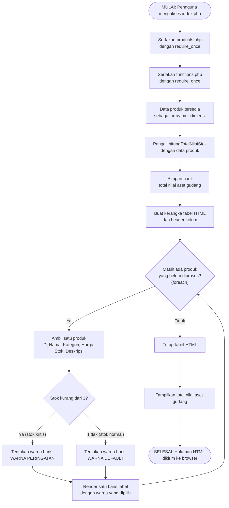
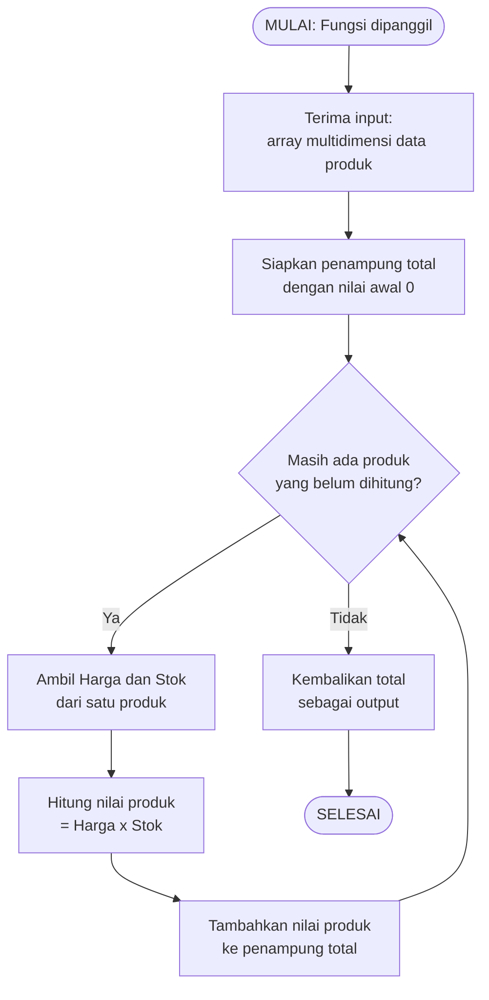
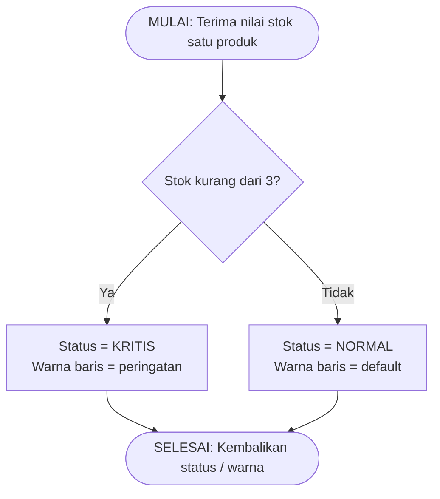
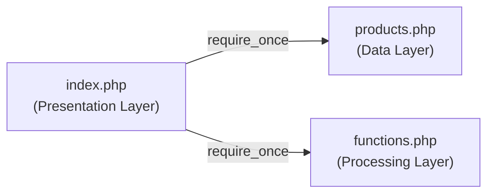

# Processing Flowchart

**Mini Project 1: Product Information System (Desain)**
Mata Kuliah: Pemrograman Web — Pertemuan 2

Dokumen ini menggambarkan alur pemrosesan sistem. Diagram memakai sintaks [Mermaid](https://mermaid.js.org/) sehingga otomatis tampil di GitHub, VS Code (ekstensi Markdown Mermaid), dan editor Markdown yang mendukungnya.

> Sesuai ketentuan sesi, dokumen ini hanya berisi rancangan alur (tanpa kode program).

**Simbol yang dipakai**

| Simbol | Arti |
|---|---|
| Kapsul / oval | Mulai atau selesai |
| Persegi | Proses |
| Belah ketupat | Keputusan (kondisi) |

---

## 1. Flowchart Utama (Alur `index.php`)

Menggambarkan seluruh proses dari pengguna membuka halaman hingga tabel tampil.

---

## 2. Flowchart Fungsi `hitungTotalNilaiStok()`

Berada di **Processing Layer** (`functions.php`). Fungsi ini mengkalkulasi nilai aset gudang.

**Ringkasan spesifikasi**

| Aspek | Keterangan |
|---|---|
| Input | Array multidimensi produk |
| Rumus per produk | Harga × Stok |
| Rumus akhir | Jumlah seluruh (Harga × Stok) |
| Output | Satu angka total nilai aset |

---

## 3. Flowchart Logika Kondisional Stok Kritis

Berada di **Processing Layer** (`functions.php`). Menyaring warna baris tabel.

**Tabel keputusan**

| Stok | Kondisi `stok < 3` | Status | Warna |
|---:|---|---|---|
| 0 | Benar | Kritis | Peringatan |
| 1 | Benar | Kritis | Peringatan |
| 2 | Benar | Kritis | Peringatan |
| 3 | **Salah** | Normal | Default |
| 4 dst. | Salah | Normal | Default |

> ⚠️ Stok bernilai tepat **3** dianggap **normal**, karena syaratnya "kurang dari 3", bukan "kurang dari atau sama dengan 3".

---

## 4. Alur Ketergantungan Berkas

Hanya `index.php` yang bergantung pada dua berkas lain. `products.php` dan `functions.php` berdiri sendiri.

---

## 5. Simulasi Alur dengan Data Contoh

Data contoh dan hasil hitung mengacu pada `SAD.md`.

| Iterasi | ID | Harga × Stok | Nilai (Rp) | Stok < 3? | Warna baris | Total berjalan (Rp) |
|---:|---|---|---:|---|---|---:|
| 1 | P001 | 8.500.000 × 5 | 42.500.000 | Tidak | Default | 42.500.000 |
| 2 | P002 | 150.000 × 2 | 300.000 | **Ya** | Peringatan | 42.800.000 |
| 3 | P003 | 650.000 × 10 | 6.500.000 | Tidak | Default | 49.300.000 |
| 4 | P004 | 1.800.000 × 1 | 1.800.000 | **Ya** | Peringatan | 51.100.000 |
| 5 | P005 | 90.000 × 25 | 2.250.000 | Tidak | Default | 53.350.000 |
| 6 | P006 | 450.000 × 3 | 1.350.000 | Tidak (batas) | Default | 54.700.000 |

**Hasil akhir:** total nilai aset gudang = **Rp 54.700.000**, dengan **2 baris** berwarna peringatan (P002 dan P004).

---

## 6. Skenario Khusus (Edge Case)

| Skenario | Perilaku yang diharapkan |
|---|---|
| Array produk kosong | Total = 0, tabel tanpa baris (disarankan menampilkan pesan "data tidak tersedia") |
| Stok = 0 | Dianggap kritis, nilai produk = 0 |
| Stok tepat 3 | Dianggap normal |
| Semua produk kritis | Seluruh baris berwarna peringatan |
| Berkas `products.php` / `functions.php` tidak ditemukan | `require_once` menghentikan proses dengan error |

---

## 7. Pemetaan Flowchart ke Ketentuan Slide

| Bagian flowchart | Ketentuan slide |
|---|---|
| Flowchart 1, langkah 2–3 | Menggunakan `require_once` |
| Flowchart 1, perulangan | Merender data ke tabel HTML via `foreach` |
| Flowchart 2 | Fungsi `hitungTotalNilaiStok()` mengkalkulasi nilai aset gudang |
| Flowchart 3 | Logika kondisional warna baris jika stok kritis (< 3) |
