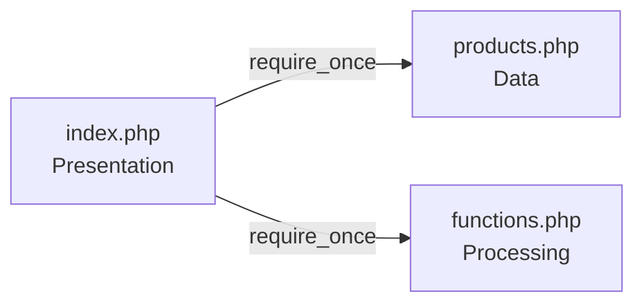

# Mini Project 1: Product Information System

> **Status: Tahap Desain (Blueprint)** — sesi ini hanya memetakan rancangan, belum ada pengetikan kode.

Proyek mata kuliah **Pemrograman Web — Pertemuan 2**. Sistem sederhana untuk mengelola dan menampilkan informasi produk, dirancang dengan arsitektur tiga lapisan (Data, Processing, Presentation).

| | |
|---|---|
| **Nama** | _[isi nama]_ |
| **NIM** | _[isi NIM]_ |
| **Kelas** | _[isi kelas]_ |

---

## 🎯 Tujuan

Merancang struktur *blueprint* sistem manajemen data informasi produk siap pakai berbasis konsep teori yang telah dipelajari.

## ✨ Fitur yang Dirancang

- Menyimpan data produk dalam **array multidimensi**.
- Menampilkan daftar produk dalam **tabel HTML**.
- Menghitung **total nilai aset gudang** (jumlah harga × stok seluruh produk).
- Menandai baris produk dengan **warna peringatan** ketika **stok kritis (< 3)**.

## 🏗️ Arsitektur

Tiga berkas dengan peran terpisah:

| Layer | Berkas | Tanggung Jawab |
|---|---|---|
| **Data Layer** | `products.php` | Menampung array multidimensi data produk (ID, Nama, Kategori, Harga, Stok, Deskripsi) |
| **Processing Layer** | `functions.php` | Fungsi `hitungTotalNilaiStok()` dan logika kondisional warna baris untuk stok kritis |
| **Presentation Layer** | `index.php` | Merajut komponen dengan `require_once` dan merender tabel HTML dengan `foreach` |



## 📁 Struktur Proyek

Dokumen desain (tersedia saat ini):

```
mini-project-1/
├── README.md                 # Ringkasan proyek (dokumen ini)
├── SAD.md                    # Software Architecture Document
└── Processing_flowchart.md   # Flowchart alur pemrosesan
```

Struktur target setelah tahap implementasi:

```
mini-project-1/
├── index.php        # Presentation Layer
├── functions.php    # Processing Layer
├── products.php     # Data Layer
├── README.md
├── SAD.md
└── Processing_flowchart.md
```

## 🗂️ Model Data Produk

| Field | Tipe | Keterangan |
|---|---|---|
| ID | String | Kode unik produk |
| Nama | String | Nama produk |
| Kategori | String | Pengelompokan produk |
| Harga | Integer | Harga satuan (Rp) |
| Stok | Integer | Jumlah barang tersedia |
| Deskripsi | String | Keterangan singkat produk |

## 📏 Aturan Bisnis

| Aturan | Keterangan |
|---|---|
| Nilai per produk | Harga × Stok |
| Total nilai aset gudang | Jumlah nilai seluruh produk |
| Stok kritis | Stok **kurang dari 3** (stok tepat 3 dianggap normal) |
| Tampilan stok kritis | Baris tabel diberi warna peringatan |

## 📚 Dokumen Desain

| Dokumen | Isi |
|---|---|
| [SAD.md](./SAD.md) | Arsitektur, rincian komponen, model data, keterlacakan ketentuan |
| [Processing_flowchart.md](./Processing_flowchart.md) | Flowchart alur utama, fungsi perhitungan, dan logika stok kritis |

## ✅ Checklist Ketentuan Mini Project

- [x] Arsitektur tiga layer (Data, Processing, Presentation)
- [x] `products.php` dirancang sebagai array multidimensi
- [x] Field produk: ID, Nama, Kategori, Harga, Stok, Deskripsi
- [x] `functions.php` dirancang berisi `hitungTotalNilaiStok()`
- [x] Logika kondisional warna baris untuk stok kritis (< 3) dirancang
- [x] `index.php` dirancang memakai `require_once`
- [x] Rendering tabel HTML dirancang dengan `foreach`
- [x] Sesi ini tanpa coding (hanya blueprint)
- [ ] Implementasi kode (sesi berikutnya)
- [ ] Pengujian hasil terhadap simulasi di SAD

## 🗓️ Roadmap

| Tahap | Kegiatan | Status |
|---|---|---|
| 1. Desain | SAD, flowchart, README | ✅ Selesai |
| 2. Implementasi | Membuat `products.php`, `functions.php`, `index.php` | ⏳ Belum |
| 3. Pengujian | Mencocokkan output dengan simulasi (total Rp 54.700.000, 2 baris kritis) | ⏳ Belum |

## ▶️ Cara Menjalankan

_Belum tersedia — akan dilengkapi setelah tahap implementasi._

Rencana: jalankan lewat server lokal PHP (misalnya XAMPP / Laragon atau server bawaan PHP), lalu buka `index.php` di browser.

## 🛠️ Teknologi

- PHP (native, tanpa framework)
- HTML
- Markdown + Mermaid (dokumentasi)

---

_Pemrograman Web — Pertemuan 2 · Mini Project 1_
