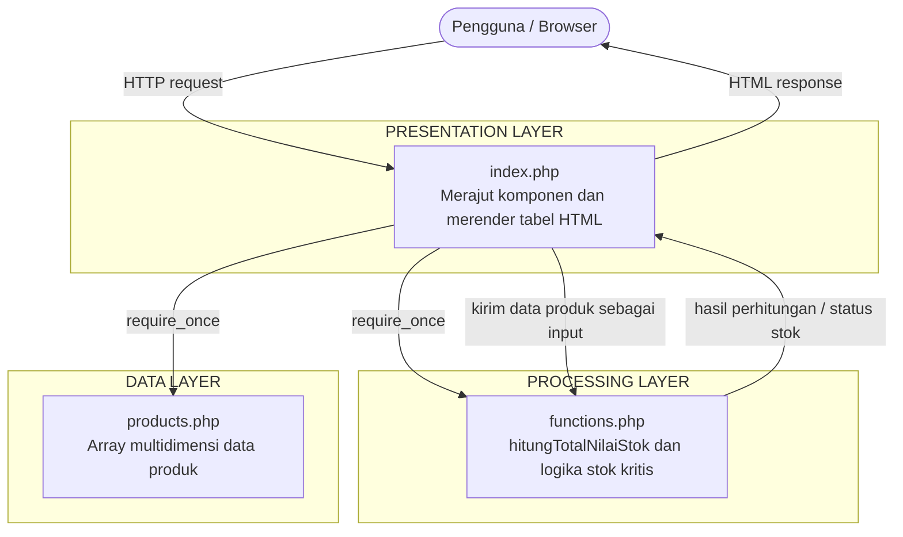
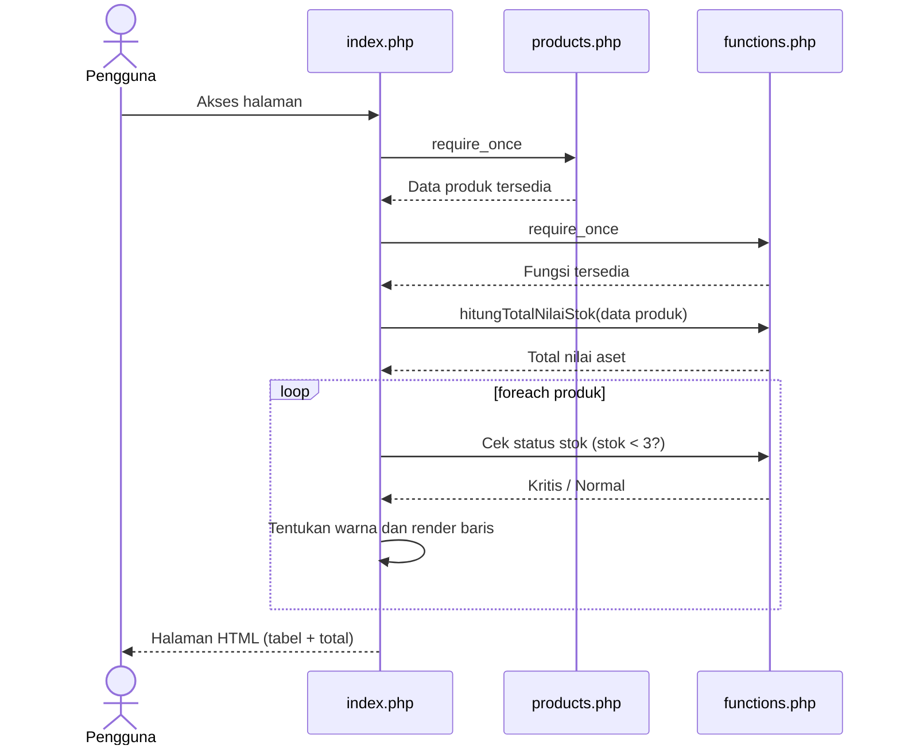

# Software Architecture Document (SAD)

**Mini Project 1: Product Information System (Desain)**
Mata Kuliah: Pemrograman Web — Pertemuan 2

| Atribut | Isi |
|---|---|
| Nama Penyusun | _[isi nama]_ |
| NIM / Kelas | _[isi NIM / kelas]_ |
| Versi Dokumen | 1.0 |
| Status | Tahap Desain (belum ada implementasi kode) |

---

## 1. Pendahuluan

### 1.1 Tujuan Dokumen
Dokumen ini menjadi *blueprint* arsitektur sistem manajemen data informasi produk siap pakai. Rancangan disusun berdasarkan konsep teori yang telah dipelajari, dan menjadi acuan sebelum tahap pengetikan kode dimulai.

### 1.2 Ruang Lingkup
Sistem menampilkan daftar produk dalam bentuk tabel HTML, menghitung total nilai aset gudang, dan menandai secara visual produk yang stoknya kritis.

**Di dalam lingkup:**
- Penyimpanan data produk dalam array multidimensi.
- Perhitungan total nilai aset gudang.
- Penyaringan warna baris tabel untuk stok kritis.
- Penyajian data ke tabel HTML.

**Di luar lingkup (sesi ini):**
- Penulisan / pengetikan kode.
- Database, autentikasi, dan fitur CRUD.

### 1.3 Definisi dan Istilah

| Istilah | Penjelasan |
|---|---|
| Blueprint | Cetak biru rancangan sistem sebelum diimplementasikan |
| Array multidimensi | Array yang tiap elemennya berupa array lain (satu elemen = satu produk) |
| Stok kritis | Kondisi ketika stok produk **kurang dari 3** |
| Nilai aset gudang | Jumlah dari (harga × stok) seluruh produk |
| `require_once` | Pernyataan PHP untuk menyertakan berkas lain, hanya satu kali |

### 1.4 Referensi
- Slide *Pemrograman Web — Pertemuan 2*, Slide 17: "Mini Project 1: Product Information System (Desain)".

---

## 2. Batasan dan Ketentuan Desain

Ketentuan berikut diambil langsung dari slide dan wajib dipenuhi:

| Kode | Ketentuan |
|---|---|
| K-01 | Arsitektur terdiri dari **3 layer**: Data, Processing, Presentation |
| K-02 | Data Layer berupa berkas `products.php` yang menampung **array multidimensi** |
| K-03 | Field data produk: **ID, Nama, Kategori, Harga, Stok, Deskripsi** |
| K-04 | Processing Layer berupa berkas `functions.php` berisi fungsi `hitungTotalNilaiStok()` |
| K-05 | Fungsi tersebut mengkalkulasi **nilai aset gudang** |
| K-06 | Terdapat **logika kondisional** untuk menyaring warna baris tabel jika **stok kritis (< 3)** |
| K-07 | Presentation Layer berupa berkas `index.php` yang merajut seluruh komponen |
| K-08 | `index.php` memakai **`require_once`** untuk menyertakan berkas lain |
| K-09 | Data dirender ke **tabel HTML** melalui perulangan **`foreach`** |
| K-10 | Sesi ini **hanya pematangan blueprint** (tanpa coding / pengetikan kode) |

---

## 3. Gambaran Arsitektur

Sistem memakai **arsitektur berlapis (layered architecture)** dengan pemisahan tanggung jawab yang jelas.

### 3.1 Prinsip Rancangan
1. **Separation of Concerns** — data, logika, dan tampilan berada di berkas terpisah.
2. **Alur ketergantungan satu arah** — hanya `index.php` yang mengenal kedua layer lain; `products.php` dan `functions.php` tidak saling bergantung.
3. **Loose coupling** — fungsi di `functions.php` menerima data lewat parameter, bukan mengambil langsung dari `products.php`, sehingga mudah diuji dan dipakai ulang.
4. **Single entry point** — pengguna hanya mengakses `index.php`.

---

## 4. Rincian Komponen

### 4.1 Data Layer — `products.php`

**Tanggung jawab:** menyimpan seluruh data komoditas produk. Tidak berisi logika perhitungan maupun tampilan.

**Struktur data:** array multidimensi. Satu elemen array luar mewakili satu produk, dan tiap produk memiliki enam field.

| Field | Tipe Data | Keterangan |
|---|---|---|
| ID | String | Kode unik produk (contoh: P001) |
| Nama | String | Nama produk |
| Kategori | String | Pengelompokan produk |
| Harga | Integer | Harga satuan dalam Rupiah |
| Stok | Integer | Jumlah barang tersedia |
| Deskripsi | String | Keterangan singkat produk |

**Contoh data rancangan** (untuk simulasi alur; termasuk kasus stok kritis dan batas nilai):

| ID | Nama | Kategori | Harga (Rp) | Stok | Deskripsi |
|---|---|---|---:|---:|---|
| P001 | Laptop Vivobook 14 | Elektronik | 8.500.000 | 5 | Laptop 14 inci untuk kuliah dan kerja |
| P002 | Mouse Wireless | Aksesoris | 150.000 | 2 | Mouse nirkabel 2.4 GHz |
| P003 | Keyboard Mekanik | Aksesoris | 650.000 | 10 | Keyboard switch biru |
| P004 | Monitor 24 inci | Elektronik | 1.800.000 | 1 | Monitor Full HD IPS |
| P005 | Flashdisk 64 GB | Penyimpanan | 90.000 | 25 | Flashdisk USB 3.0 |
| P006 | Headset Gaming | Aksesoris | 450.000 | 3 | Headset dengan mikrofon |

### 4.2 Processing Layer — `functions.php`

**Tanggung jawab:** seluruh logika pemrosesan data.

**A. Fungsi `hitungTotalNilaiStok()`**

| Aspek | Spesifikasi |
|---|---|
| Tujuan | Menghitung total nilai aset gudang |
| Input | Array multidimensi data produk |
| Proses | Untuk tiap produk: harga × stok, lalu semua hasil dijumlahkan |
| Output | Satu angka total nilai aset (Integer) |
| Efek samping | Tidak ada (tidak mengubah data asli) |

**B. Logika kondisional stok kritis**

| Aspek | Spesifikasi |
|---|---|
| Tujuan | Menentukan penyaringan warna baris tabel |
| Input | Nilai stok satu produk |
| Aturan | Stok **< 3** = kritis, stok **≥ 3** = normal |
| Output | Penanda status (kritis / normal) yang dipakai untuk memilih warna baris |

Tabel keputusan:

| Stok | Status | Warna Baris |
|---:|---|---|
| 0, 1, 2 | Kritis | Warna peringatan (mis. merah muda) |
| 3 atau lebih | Normal | Warna default |

> ⚠️ Batas memakai **kurang dari** (`<`), bukan "kurang dari atau sama dengan". Stok tepat 3 **bukan** stok kritis.

> 💡 Usulan (bukan syarat slide): logika kondisional dapat dibungkus dalam satu fungsi bantu di `functions.php` agar `index.php` tetap bersih.

### 4.3 Presentation Layer — `index.php`

**Tanggung jawab:** merajut seluruh komponen dan menampilkan hasil ke pengguna.

| Langkah | Rincian |
|---|---|
| 1 | Menyertakan `products.php` dan `functions.php` dengan `require_once` |
| 2 | Memanggil `hitungTotalNilaiStok()` dengan data produk |
| 3 | Membuat kerangka tabel HTML (header kolom) |
| 4 | Melakukan perulangan `foreach` pada tiap produk untuk membuat satu baris tabel |
| 5 | Menerapkan warna baris sesuai status stok |
| 6 | Menampilkan total nilai aset gudang |

**Rancangan tampilan tabel:**

| No | ID | Nama | Kategori | Harga | Stok | Deskripsi |
|---|---|---|---|---|---|---|

Total nilai aset gudang ditampilkan di bawah tabel.

**Alasan memakai `require_once` (bukan `include`):**
- Berkas wajib ada; jika hilang, proses berhenti dengan error yang jelas.
- Berkas hanya disertakan sekali, sehingga tidak terjadi deklarasi ulang fungsi.

---

## 5. Tinjauan Proses (Process View)

Alur lengkap ada di [`Processing_flowchart.md`](./Processing_flowchart.md).

Ringkasan urutan interaksi:

---

## 6. Simulasi Hasil Rancangan (Verifikasi Logika)

Perhitungan dengan data contoh di 4.1:

| ID | Harga × Stok | Nilai (Rp) | Status Stok |
|---|---|---:|---|
| P001 | 8.500.000 × 5 | 42.500.000 | Normal |
| P002 | 150.000 × 2 | 300.000 | **Kritis** |
| P003 | 650.000 × 10 | 6.500.000 | Normal |
| P004 | 1.800.000 × 1 | 1.800.000 | **Kritis** |
| P005 | 90.000 × 25 | 2.250.000 | Normal |
| P006 | 450.000 × 3 | 1.350.000 | Normal (batas) |
| | **Total nilai aset gudang** | **54.700.000** | |

Hasil yang diharapkan saat implementasi: **2 baris berwarna peringatan** (P002 dan P004) dan total **Rp 54.700.000**.

---

## 7. Keterlacakan Ketentuan (Traceability)

| Ketentuan | Dipenuhi oleh | Bagian SAD |
|---|---|---|
| K-01 | Arsitektur 3 layer | 3 |
| K-02, K-03 | `products.php` | 4.1 |
| K-04, K-05 | `functions.php` — `hitungTotalNilaiStok()` | 4.2 A |
| K-06 | `functions.php` — logika kondisional | 4.2 B |
| K-07, K-08 | `index.php` — `require_once` | 4.3 |
| K-09 | `index.php` — `foreach` ke tabel HTML | 4.3 |
| K-10 | Dokumen berisi rancangan tanpa kode | Seluruh dokumen |

---

## 8. Kualitas Rancangan

| Atribut | Cara pemenuhan |
|---|---|
| Keterbacaan | Tiga berkas dengan peran jelas |
| Kemudahan pemeliharaan | Mengubah data, logika, atau tampilan cukup di satu berkas |
| Kemudahan diuji | Fungsi menerima input lewat parameter |
| Keterpakaian ulang | Fungsi dapat dipakai halaman lain |
| Kesederhanaan | Tanpa database dan framework, sesuai materi yang dipelajari |

## 9. Asumsi dan Risiko

| # | Asumsi / Risiko | Penanganan |
|---|---|---|
| 1 | Data contoh bersifat rancangan, dapat diganti sesuai kebutuhan | Struktur field tetap |
| 2 | Data hanya disimpan di berkas (tidak permanen di database) | Sesuai lingkup mini project |
| 3 | Data kosong bisa menghasilkan tabel tanpa baris | Rencanakan pesan "data tidak tersedia" |
| 4 | Harga / stok bernilai tidak valid | Asumsikan data sudah valid di tahap ini |

## 10. Rencana Tahap Berikutnya

1. Sesi Desain (saat ini): SAD, flowchart, README.
2. Sesi Implementasi: membuat `products.php`, `functions.php`, lalu `index.php`.
3. Sesi Pengujian: mencocokkan hasil dengan simulasi pada bagian 6.
